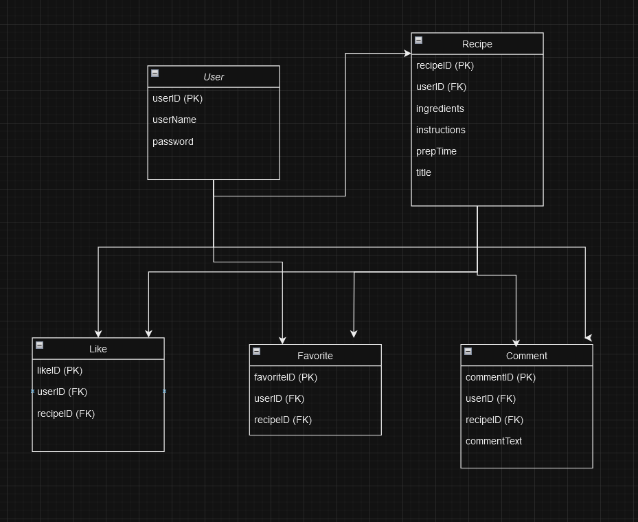

**Description:**

User: 

Represents individuals using the application. Each user has a unique identifier (user_id) and attributes that describe them, such as username, and password.

Recipe:

Represents the recipes posted by users. Each recipe is uniquely identified by recipe_id and includes attributes like title, ingredients, instructions, and prep_time. The user_id foreign key links each recipe to the user who created it.

Like:

Captures user interactions where users express their appreciation for recipes. Each like is uniquely identified by like_id and includes user_id and recipe_id as foreign keys, linking back to the User and Recipe entities.

Favorite:

Similar to Likes, but indicates a stronger interest in a recipe. Each favorite has a unique identifier and links users to recipes they have marked as favorites.

Comment: 
Allows users to leave feedback or thoughts on recipes. Each comment includes comment_id, user_id, recipe_id, and comment_text, providing a way to interact and engage with the content.
