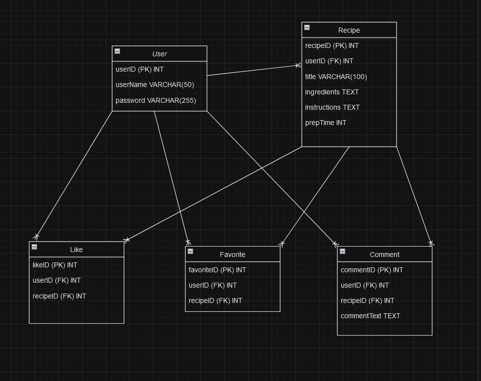

**Description:**

Integer types (INT) are used for IDs and counts, while variable-length strings (VARCHAR) and text types (TEXT) are used for textual data.

Primary Keys: 

Each table has a primary key defined to uniquely identify records.

Foreign Keys: 

These establish relationships between tables. For example, the user_id in the Recipe table references the User table, enforcing referential integrity.

Unique Constraints: 

In the Like and Favorite tables, a unique constraint on the combination of user_id and recipe_id prevents users from liking or favoriting the same recipe multiple times.
