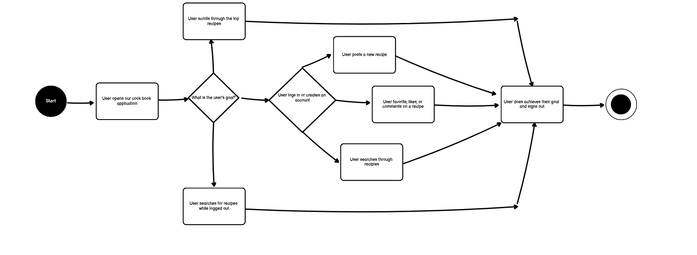
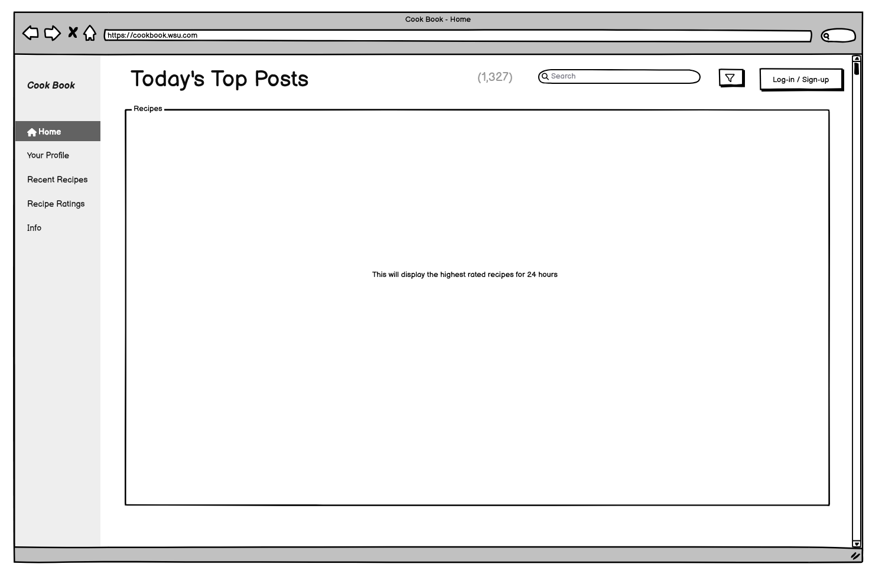
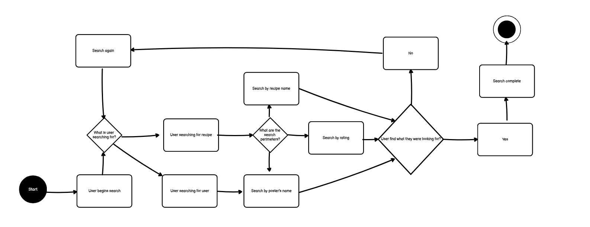
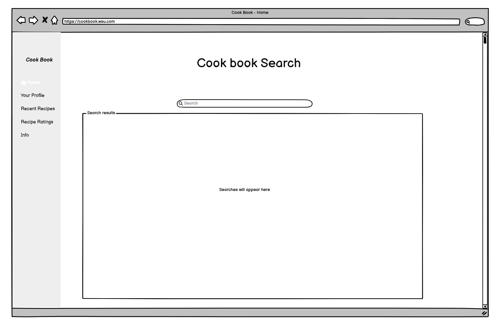

**Landing / Main application page**

- Goal:
- This will be the main homepage of our app.
User Flow:
  - 1: User's purpose:
     - The first part of the user flow decides what the user is aiming to do on our application.
     - While logged out users can search for and scroll through the featured homepage recipes.
     - If the user decides to login they have more options to choose from.
  - 2: User login:
      - User's are able to login or create an account.
      - Once they are on their account options such as posting recipies are available.
      - User's can now also favorite, comment on, and like other's posts.
  - 3: Goal achieved:
       - Once the user accomplishes their task on the application they will logout or exit the application.

  Wireframe:
  - Layout:
      - The title of the page is located in the top middle indicating that these are the top rated posts for today.
      - The login button is located top right of the search bar so it is easy to access the login page.
      - The search bar is located on the top right so user's can easily search for recipes upon logging into the site.
      - The sidebar contains links to your profile, if you are not signed in it will take you to a login page, recently posted recipes, recipe ratings which is the highest rated of all time, and info which would display our contact information to get ahold of us.

**Search**

- Goal:
- This will allow users to search for recipes on our application.
User Flow:
  - 1: User begins search:
        - The user decides on searching for either a recipe or for another user.
  - 2: Search perimeters:
      - The user decides on what perimeters to search by.
      - If searching for another user then they must search the their username.
      - If searching for a recipe then the user must search by recipe name, poster's name, or by rating.
  - 3: Search results:
      - If the results of the search are successfull then the user can finish searching.
      - If the results are not successful then the user will need to keep searching.

  Wireframe:
  - Layout:
      - The basic layout of the main page stays with the submenu bar still on the right side.
      - The search bar is now in the middle top of the screen since the user is now searching.
      - The results appear below the search bar.

**Create**

- Goal:
- This will allow users to create a new entity or a post in the application.
User Flow:
  - 1: 'Create' Button:
    - Create Button will be clearly displayed to simplify it for users.
    - User clicks the 'Create' button to show the 'Create' page for the users to begin inputting content. After, click 'Create' when done.
 - 2: Decision Node:
   - Did they create the recipe they wanted? Does it have the tags for the system to know what category it belongs?
   - Verification:
     - If yes, save and post the content. Will display message for user as a verification that the content was created: "Recipe posted!"
     - If no, show error message and ask user to enter valid content. Ex: "Title required", "Tags required".
 - 3: Post-Submission:
   - After creating post, it will refresh to the user's page where it lists their existing posts and will add the newly created recipe.
  
Wireframe:
- Layout:
  - Title: Placed at the top-left corner with placeholder (TITLE)
  - Date Create: Placed at the top-right corner with placeholder (Date Created)
  - Upload: Under title but above ingredients and recipe (Image of Dish)
  - Ingredients: Under Image
  - Recipe: Under Ingredients
  - Tags: Under Recipe but above the 'Create' button

  - Post-Submission: Once created, it'll send users to their Posts and have a marker at the right that says 'Post Successfully Created'

  - If there was no post created, it will show an Error message.

**Update:**

- Goal:
- This allows user to update the existing content and make necessary changes.
User Flow:
  - 1: 'Update' Button:
    - The user navigates to an existing post or a previously created recipe and there will be an 'Edit' option.
    - Clicking the button will open the existing content but now in modifiable mode so user can input changes then click 'Save' after.
  - 2: Decision Node:
    - Did they put the necessary changes? Were they valid?
    - Verification:
      - If yes, entity is updated with new data and will show user the verification popup "Changes saved!"
      - If no, error message will be triggered if there were no changes made and ask user to make changes. It will have a button to let users get out.
  - 3: Post-Update Navigation:
    - After, it will refresh page with newly inputted content in the post.

Wireframe:
- Layout:
  - In Posts (User's Posts), it'll have a 'Edit' button at the top-right.

  - Once clicked, the layout will be the already created post but modifiable and a 'UPDATE!' button at the bottom instead of 'Create!'

  - Post-Update: If successful, it'll show the user back to their Posts with a marker on the right that says the update was successful

  - If not, it'll give Error Message that tells them it's invalid and to go back.

